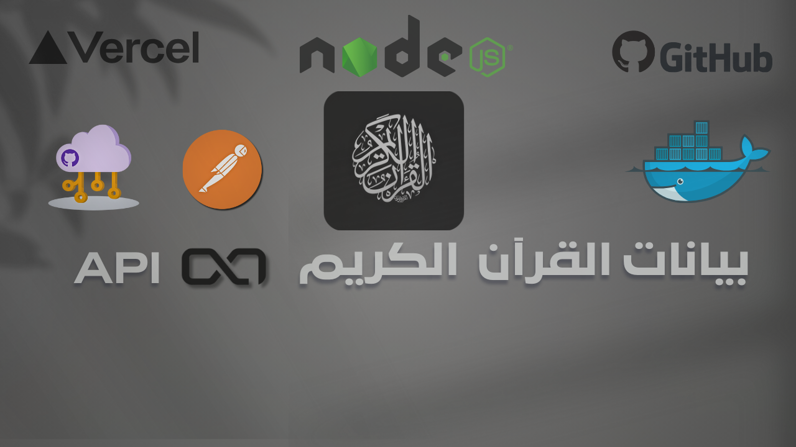
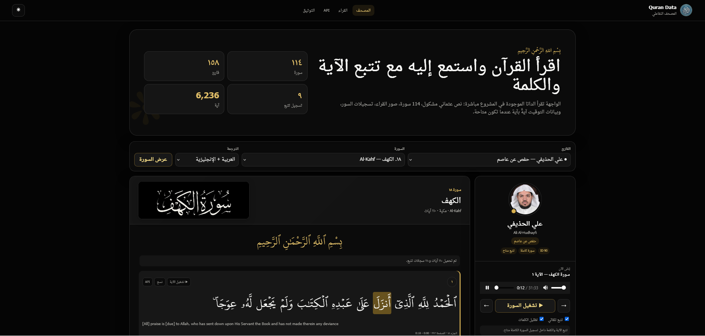
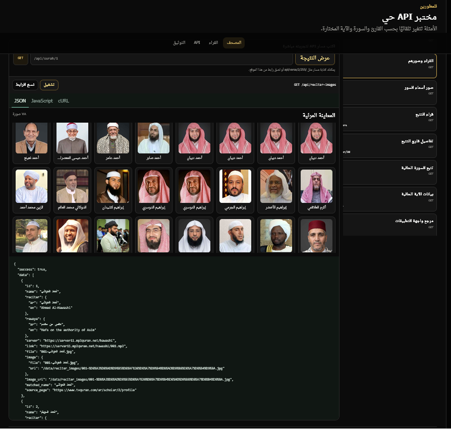

# Quran Data

## مقدمة

مشروع `quran_data` يوفر بيانات شاملة عن القرآن الكريم، بما في ذلك السور، الآيات، والصوتيات. يوفر المشروع قواعد البيانات بصيغ متعددة مثل JSON وCSV وSQLite، ويشمل أيضًا واجهة برمجة تطبيقات (API) لعرض هذه المعلومات وتسهيل الوصول إليها.

---
<br/>

---

## موقع التوثيق لواجهة تطبيق البرمجيات 3.1.0 



---
<br/>

---

## الموقع التجريبي الذي يوري المستخدم كيفية شكل البايانا عند جلبها



---
<br/>

---

## قسم API LIve يمكن المستخدم من عمل GET ورؤية شكل البيانات



---
<br/>

---

## آخر تحديثات الإصدار 3.1.0 — 29 و30 أغسطس 2026

### البيانات وواجهة API

- توحيد مسار بناء البيانات لإنتاج JSON وCSV وSQLite من المصادر الموجودة داخل `data/` دون تعديل ملفات المصدر.
- إضافة جداول مترابطة للقراء والصور وأسماء السور والتوقيت التقليدي وتتبع الآيات والكلمات.
- توثيق **158 قارئًا صوتيًا**، و**96 قارئ توقيت**، و**600,327 سجل توقيت آية**، و**38 قارئًا آية بآية**.
- دعم **9 مجموعات تتبع حديثة** من `data/Timming-Reciters-ayahBayah` بنوعي `surah-by-surah` و`ayah-by-ayah`.
- توسيع OpenAPI ومرجع API ليشملا صور القراء، صور أسماء السور، صوت الآية، وبيانات التتبع.

### الحذيفي والتتبع كلمة بكلمة

- إضافة الشيخ **علي الحذيفي** إلى قراء التتبع بالمعرّف `90` ورواية حفص عن عاصم.
- ربط 114 تسجيل سورة و6,236 سجل آية و77,429 مقطع كلمة من:
  - `data/Timming-Reciters-ayahBayah/surah-recitation-ali-abdur-rahman-al-huthaify/surah.json`
  - `data/Timming-Reciters-ayahBayah/surah-recitation-ali-abdur-rahman-al-huthaify/segments.json`
- إصلاح بدء التتبع عند الضغط على زر التشغيل الأصلي داخل مشغل الصوت، وليس فقط عند الضغط على زر «تشغيل السورة».
- تحديث التتبع بعد تحريك شريط الزمن يدويًا، بحيث تتغير الآية والكلمة المظللة فورًا.

### المصحف التفاعلي والوثائق

- تطوير المصحف التفاعلي في `/reader` و`/index.html` مع تشغيل السورة أو الآية وتتبع الآية والكلمة عند توفر التوقيت.
- إضافة حقل route داخل قسم **API Live**؛ يمكن كتابة مسار مثل `/api/ayah-bayah/90/1/1` وعرض JSON مباشرة.
- إضافة معاينات مرئية لصور صفحات المصحف والقراء وأسماء السور داخل مختبر API.
- جعل `index.html` و`docs.html` متجاوبتين مع الهواتف والأجهزة اللوحية، بما يشمل القوائم والبطاقات وReDoc والمخرجات البرمجية وأزرار اللمس.
- تحسين معرض صور القراء وأسماء السور، والتحميل التدريجي، والوضعين الفاتح والداكن.

للتفاصيل الخاصة بمسار بناء البيانات راجع [README_DATA_PIPELINE.md](./README_DATA_PIPELINE.md)، ولتفاصيل API راجع [README_API.md](./README_API.md).
## 🌳 هيكل المشروع

<details open>
<summary>📂 <strong>Quran-Data</strong> — هيكلة المشروع مع تعريف مختصر</summary>

<br>

### 📄 ملفات المشروع الرئيسية

* 📄 `README.md` — التوثيق الرئيسي للمشروع وطريقة الاستخدام.
* 📄 `README_API.md` — شرح واجهة برمجة التطبيقات API واستخدامها.
* 📄 `README_DATA_PIPELINE.md` — توثيق مسار بناء وتحويل ومعالجة البيانات.
* 📄 `DEPLOYMENT.md` — تعليمات نشر المشروع وتشغيله في بيئة الإنتاج.
* 📄 `DEPLOY_READY.md` — ملاحظات وتجهيزات المشروع قبل النشر.
* 📄 `DEPLOYMENT_FIXES.md` — إصلاحات وملاحظات متعلقة بمشاكل النشر.
* 📄 `V3.1.0_NOTES.md` — ملاحظات وإضافات الإصدار `3.1.0`.
* 📄 `LICENSE` — رخصة استخدام وتوزيع المشروع.

### ⚙️ ملفات التشغيل والنشر

* 🐳 `Dockerfile` — إعداد حاوية Docker لتشغيل المشروع.
* ⚙️ `package.json` — إعدادات Node.js والاعتماديات وأوامر التشغيل والبناء.
* 🔒 `pnpm-lock.yaml` — تثبيت إصدارات الحزم المستخدمة بواسطة pnpm.
* ⚙️ `nodemon.json` — إعدادات Nodemon لإعادة تشغيل الخادم أثناء التطوير.
* ☁️ `render.yaml` — إعدادات نشر المشروع على منصة Render.
* ▲ `vercel.json` — إعدادات نشر المشروع على منصة Vercel.

---

<details>
<summary>📂 <strong>api</strong> — نقطة دخول API عند التشغيل في بيئة Serverless</summary>

<br>

* `index.js` — يربط بيئة الاستضافة بتطبيق الخادم الرئيسي.

</details>

---

<details>
<summary>📂 <strong>docs</strong> — ملفات توثيق وتعريف واجهة API</summary>

<br>

* `api-definition.yaml` — تعريف API بصيغة OpenAPI لعرض المسارات والطلبات والاستجابات.

</details>

---

<details>
<summary>📂 <strong>data</strong> — بيانات القرآن والصوتيات والصور وقواعد البيانات والتوقيت</summary>

<br>

<details>
<summary>🎧 <strong>audio_verseByverse</strong> — ملفات صوت الآيات</summary>

<br>

يحتوي على ملفات التلاوة الصوتية المقسمة **آيةً بآية** لاستخدامها في تشغيل الآيات والمزامنة والتكرار.

</details>

<details>
<summary>📊 <strong>csv</strong> — البيانات المصدرة بصيغة CSV</summary>

<br>

يحتوي على البيانات المحولة والمنظمة بصيغة CSV لاستخدامها في التحليل أو الاستيراد إلى قواعد البيانات والبرامج الأخرى.

</details>

<details>
<summary>🧾 <strong>json</strong> — بيانات المشروع المنظمة بصيغة JSON</summary>

<br>

يحتوي على بيانات القرآن والسور والآيات والصوتيات والتوقيت بصيغة JSON.

</details>

<details>
<summary>🖼️ <strong>quran_image</strong> — صور صفحات ومحتوى المصحف</summary>

<br>

يحتوي على صور صفحات القرآن والمحتوى الرسومي المستخدم داخل واجهة المصحف.

</details>

<details>
<summary>👤 <strong>reciter_images</strong> — صور القراء وفهارس الربط</summary>

<br>

يحتوي على صور القراء والبيانات أو الفهارس المستخدمة لربط كل قارئ بصورته داخل الموقع وواجهة API.

</details>

<details>
<summary>💾 <strong>sqlite</strong> — قواعد بيانات SQLite</summary>

<br>

يحتوي على قواعد البيانات المحلية الناتجة من معالجة بيانات JSON والتوقيت وغيرها.

</details>

<details>
<summary>🏷️ <strong>suwer-name</strong> — صور وملفات أسماء السور</summary>

<br>

يحتوي على الملفات الرسومية الخاصة بأسماء سور القرآن لاستخدامها داخل واجهة المصحف.

</details>

<details>
<summary>⏱️ <strong>Timming-Reciters-ayahBayah</strong> — توقيت الآيات والكلمات والتلاوات</summary>

<br>

يحتوي على بيانات توقيت التلاوات الخاصة بالقراء على مستوى:

* الآية.
* الكلمة.
* السورة.
* بداية ونهاية المقاطع الصوتية.
* مزامنة النص القرآني مع التلاوة.

</details>

</details>

---

<details>
<summary>📂 <strong>scripts</strong> — سكربتات بناء وتحويل وفحص واختبار البيانات</summary>

<br>

### 📚 التوثيق

* `README.md` — توثيق السكربتات وطريقة استخدامها.

### 🏗️ بناء وإعادة بناء البيانات

* `buildData.mjs` — بناء بيانات المشروع الناتجة من المصادر الأساسية.
* `rebuildData.mjs` — إعادة بناء بيانات المشروع من جديد.
* `cleanGeneratedData.mjs` — تنظيف الملفات والبيانات المولدة سابقًا.
* `dataPipelineLib.mjs` — دوال مشتركة لمسار معالجة البيانات `Data Pipeline`.
* `runtime.mjs` — أدوات وإعدادات تشغيل مشتركة للسكربتات.

### 🔄 تحويل وتجهيز البيانات

* `splitData.mjs` — تقسيم البيانات الكبيرة إلى ملفات أصغر ومنظمة.
* `jsonToSqlite.mjs` — تحويل بيانات JSON إلى قاعدة بيانات SQLite.
* `jsonToCsv.mjs` — تحويل بيانات JSON إلى ملفات CSV.
* `addTimingToSqlite.mjs` — إضافة بيانات توقيت التلاوات إلى SQLite.
* `addApiReferenceToSqlite.mjs` — إضافة مرجع API إلى قاعدة بيانات SQLite.
* `addJsonToSqlite.mjs` — إدخال ملفات JSON إضافية إلى SQLite.

### 🌐 جلب ومعالجة البيانات

* `fetchJson.mjs` — جلب بيانات JSON من مصادر خارجية.
* `translateText.mjs` — ترجمة النصوص المستخدمة في البيانات.
* `jsonUtils.mjs` — دوال مساعدة للتعامل مع ملفات JSON.

### ⏱️ معالجة بيانات التوقيت

* `timingUtils.mjs` — دوال مساعدة لمعالجة بيانات التوقيت.
* `getTimingSudais.mjs` — استخراج أو معالجة بيانات توقيت تلاوة السديس.
* `simpleTiming.mjs` — أدوات أو أمثلة مبسطة لمعالجة التوقيت.
* `timingExamples.mjs` — أمثلة على استخدام بيانات ودوال التوقيت.

### ✅ التحقق والفحص

* `checkDatabase.mjs` — فحص قاعدة البيانات والتأكد من سلامتها.
* `verifyApiReference.mjs` — التحقق من بيانات مرجع API.
* `verifyDataPipeline.mjs` — التحقق من سلامة مسار معالجة وبناء البيانات.

### 🧪 الاختبارات

* `testAPI.mjs` — اختبار وظائف ومسارات API.
* `simpleAPITest.mjs` — اختبار مبسط وسريع لواجهة API.
* `testRenderAPI.mjs` — اختبار API في بيئة Render.
* `testReaderSite.mjs` — اختبار واجهة المصحف التفاعلي.
* `testReciterData.mjs` — اختبار بيانات القراء والتلاوات.
* `testJsonOperations.mjs` — اختبار عمليات القراءة والمعالجة على JSON.

</details>

---

<details>
<summary>🖥️ <strong>server</strong> — الخادم الرئيسي والواجهة الخلفية Backend</summary>

<br>

### ⚙️ ملفات الخادم الرئيسية

* `config.mjs` — إعدادات التطبيق والمسارات والمتغيرات المستخدمة في الخادم.
* `server.mjs` — نقطة الدخول الرئيسية لإنشاء وتشغيل تطبيق Express.

---

<details>
<summary>🎮 <strong>controllers</strong> — منطق معالجة طلبات API</summary>

<br>

* `surahController.mjs` — معالجة طلبات السور والآيات والصوتيات والبيانات القرآنية.
* `timingController.mjs` — معالجة طلبات توقيت التلاوات والآيات.

</details>

<details>
<summary>🛡️ <strong>middleware</strong> — وظائف وسيطة للحماية وإدارة الطلبات</summary>

<br>

* `rateLimiter.mjs` — تحديد معدل الطلبات للحماية وتقليل إساءة استخدام API.

</details>

<details>
<summary>🛣️ <strong>routes</strong> — تعريف مسارات واجهة API</summary>

<br>

* `apiRoutes.mjs` — تعريف وربط Endpoints بالـ Controllers المناسبة.

</details>

<details>
<summary>⚙️ <strong>services</strong> — الخدمات ومنطق الأعمال المشترك</summary>

<br>

* `reciterDataService.mjs` — قراءة وتجهيز وفهرسة بيانات القراء والتلاوات.

</details>

<details>
<summary>🧰 <strong>utils</strong> — أدوات ودوال مساعدة للخادم</summary>

<br>

* `errorHandler.mjs` — معالجة أخطاء التطبيق وإرجاع استجابات مناسبة.
* `errorUtils.mjs` — دوال مساعدة لإنشاء وتنظيم الأخطاء.
* `notFoundHandler.mjs` — معالجة المسارات والطلبات غير الموجودة.

</details>

<details>
<summary>🌐 <strong>public</strong> — ملفات الواجهة الأمامية التي يقدمها الخادم</summary>

<br>

### 🖥️ صفحات وملفات الواجهة

* `docs.html` — صفحة التوثيق الرئيسية لواجهة API.
* `index.html` — المصحف التفاعلي ومختبر API Live.
* `reader.js` — منطق المصحف وتشغيل الصوت وتتبع الآية والكلمة.
* `reader.css` — تنسيق وتصميم واجهة المصحف التفاعلي.
* `style.css` — تنسيق صفحة التوثيق وواجهة ReDoc.

### 📚 مكتبة التوثيق

* `redoc.standalone.js` — مكتبة ReDoc المحلية المستخدمة لعرض تعريف OpenAPI.

### 🔤 الخطوط

* `uthmanic_hafs.ttf` — خط عثماني لعرض نص القرآن الكريم.
* `arabic-font.ttf` — خط عربي إضافي مستخدم في الواجهة.

### 🎨 الصور والأيقونات

* `Quran-Data.png` — الشعار أو الصورة الرئيسية للمشروع.
* `Quran-Data.svg` — نسخة SVG من شعار المشروع.
* `quran-data-icon.svg` — أيقونة SVG للمشروع.
* `favicon.ico` — أيقونة الموقع التي تظهر في المتصفح.
* `icon-192.png` — أيقونة المشروع بقياس `192×192`.

</details>

</details>

---

### 🧪 اختبار API من جذر المشروع

* `test-api.js` — اختبار سريع لواجهة API من جذر المشروع.

</details>

## كيفية التشغيل

1. **تثبيت التبعيات:**

   يتطلب المشروع Node.js 22، ويستخدم `pnpm` لإدارة الحزم:

   ```bash
   pnpm install
   ```

2. **تشغيل الخادم:**

   لتشغيل الخادم، استخدم الأمر التالي:

   ```bash
   pnpm start
   ```

   سيتم تشغيل الخادم على المنفذ المحدد في ملف `config.mjs`.

3. **تشغيل السكربتات:**

   لإعادة بناء البيانات والتحقق منها كاملة:

   ```bash
   pnpm run data:rebuild
   ```

   أو شغّل صيغة محددة:

   ```bash
   pnpm run data:json
   pnpm run data:csv
   pnpm run data:sqlite
   pnpm run data:verify
   ```

   **أوامر السكربتات الفردية:**
   ```bash
   pnpm run splitData
   pnpm run jsonToSqlite
   pnpm run addTimingToSqlite
   pnpm run addApiReferenceToSqlite
   pnpm run jsonToCsv
   ```

   > **ملاحظة:** راجع `scripts/README.md` للتفاصيل الكاملة حول كل سكربت.

## 📊 إحصائيات البيانات

### 📖 **المحتوى القرآني:**
- **114** سورة
- **6,236** آية  
- **158** قارئ صوتي مع روايات مختلفة
- **96** قارئًا في بيانات التوقيت التقليدية
- **600,327** سجل توقيت آية
- **38** قارئًا بصوت آية بآية
- **9** قراء في بيانات التتبع الحديثة، تشمل **56,124** سجل آية و**558,824** مقطع كلمة
- **604** صورة صفحة القرآن بجودة عالية
- **158** صورة قارئ مرتبطة بالمعرّفات
- **114** صورة SVG لأسماء السور

### 🗃️ **أشكال البيانات المتاحة:**
- **JSON** - ملفات منفصلة ومجمعة
- **SQLite** - قاعدة بيانات محلية سريعة  
- **CSV** - جداول بيانات تقليدية
- **API REST** - واجهة برمجية مباشرة

### 🔧 **ميزات API:**
- مسارات للسور والآيات والأجزاء والسجدة والصوتيات والصفحات والقراء
- دعم التوقيت التقليدي والتتبع الحديث للآية والكلمة
- صوت آية بآية وتسجيل سورة كاملة
- صور القراء وصور SVG لأسماء السور
- صور صفحات القرآن
- مرجع OpenAPI شامل وصفحة ReDoc تفاعلية

## تفاصيل البيانات

### mainDataQuran.json

يحتوي على بيانات مفصلة عن السور والآيات بما في ذلك النصوص، عدد الآيات، عدد الكلمات، عدد الحروف، الصوتيات، والمزيد. الهيكل العام للبيانات هو كما يلي:

```json
[
  {
    "number": 0, // رقم السورة
    "name": {
      "ar": "", // الاسم بالعربية
      "en": "", // الاسم بالإنجليزية
      "transliteration": "" // الاسم بالنقل الصوتي
    },
    "revelation_place": {
      "ar": "", // مكان النزول بالعربية
      "en": "" // مكان النزول بالإنجليزية
    },
    "verses_count": 0, // عدد الآيات في السورة
    "words_count": 0, // عدد الكلمات في السورة
    "letters_count": 0, // عدد الحروف في السورة
    "verses": [
      {
        "number": 0, // رقم الآية في السورة
        "text": {
          "ar": "", // النص بالعربية
          "en": "" // النص بالإنجليزية
        },
        "juz": 0, // الجزء الذي تنتمي إليه الآية
        "page": 0, // رقم الصفحة التي تظهر فيها الآية
        "sajda": false // معلومات حول السجدة
      }
    ],
    "audio": [
      {
        "id": 0, // معرف التسجيل الصوتي
        "reciter": {
          "ar": "", // اسم القارئ بالعربية
          "en": "" // اسم القارئ بالإنجليزية
        },
        "rewaya": {
          "ar": "", // الرواية بالعربية
          "en": "" // الرواية بالإنجليزية
        },
        "server": "", // اسم الخادم
        "link": "" // رابط التسجيل الصوتي
      }
    ]
  }
]
```

## كيفية استخدام واجهة برمجة التطبيقات (API)

لمزيد من المعلومات حول كيفية استخدام واجهة برمجة التطبيقات، [راجع صفحة الوثائق الرسمية](https://msr-quran-data.vercel.app/docs).

- **الخادم الرسمي**: `https://msr-quran-data.vercel.app/api`
- **الخادم المحلي**: `http://localhost:5000/api`

## 🚀 النقاط النهائية (Endpoints)

### 1. 🕌 استرجاع جميع السور

- **النقطة**: `/surahs`
- **الطريقة**: `GET`
- **الوصف**: استرجاع قائمة بجميع السور في القرآن.

#### 📦 مثال `curl`:

```bash
curl -X GET "http://localhost:5000/api/surahs"
```

#### ✅ الاستجابة:

```json
{
  "success": true,
  "result": [
    {
      "number": 1,
      "name": {
        "ar": "الفاتحة",
        "en": "The Opening",
        "transliteration": "Al-Fatihah"
      },
      "revelation_place": {
        "ar": "مكية",
        "en": "Meccan"
      },
      "verses_count": 7,
      "words_count": 29,
      "letters_count": 139
    }
  ]
}
```

---

### 2. 📖 استرجاع سورة محددة

- **النقطة**: `/surah`
- **الطريقة**: `GET`
- **الوصف**: استرجاع سورة معينة باستخدام معرف (ID) السورة.

#### 📝 المعلمة:

- `surah_id` (إجباري) - معرف السورة.

#### 📦 مثال `curl`:

```bash copybtn prompt:"$"
curl -X GET "http://localhost:5000/api/surah?surah_id=1"
or
curl -X GET "http://localhost:5000/api/surah/1"
```

#### ✅ الاستجابة:

```json copybtn
{
  "success": true,
  "result": {
    "number": 1,
    "name": {
      "ar": "الفاتحة",
      "en": "The Opening",
      "transliteration": "Al-Fatihah"
    },
    "verses_count": 7,
    "audio": [
      {
        "id": 1,
        "reciter": {
          "ar": "أحمد الحواشي",
          "en": "Ahmed Al-Hawashi"
        },
        "link": "https://server11.mp3quran.net/hawashi/001.mp3"
      }
    ]
  }
}
```

---

### 3. 📜 استرجاع جميع الآيات لسورة محددة

- **النقطة**: `/verses`
- **الطريقة**: `GET`
- **الوصف**: استرجاع جميع الآيات الخاصة بسورة معينة.

#### 📝 المعلمة:

- `surah_id` (إجباري) - معرف السورة.

#### 📦 مثال `curl`:

```bash copybtn prompt:"$"
curl -X GET "http://localhost:5000/api/verses?surah_id=1"
or
curl -X GET "http://localhost:5000/api/verses/1"
```

#### ✅ الاستجابة:

```json copybtn
{
  "success": true,
  "result": [
    {
      "number": 1,
      "text": {
        "ar": "الٓمٓ",
        "en": "Alif, Lam, Meem"
      },
      "juz": 1,
      "page": 2
    }
  ]
}
```

---

### 4. 🕋 استرجاع جميع الآيات التي تحتوي على سجدة

- **النقطة**: `/sajda`
- **الطريقة**: `GET`
- **الوصف**: استرجاع قائمة بالآيات التي تحتوي على مواضع سجدة.

#### 📦 مثال `curl`:

```bash copybtn prompt:"$"
curl -X GET "http://localhost:5000/api/sajda"
```

#### ✅ الاستجابة:

```json copybtn
{
  "success": true,
  "result": [
    {
      "number": 15,
      "text": {
        "ar": "وَلِلَّهِۤ يَسۡجُدُۤ...",
        "en": "And to Allah prostrates..."
      },
      "sajda": {
        "id": 2,
        "recommended": true
      }
    }
  ]
}
```

---

### 5. 🎧 استرجاع التسجيل الصوتي لسورة محددة

- **النقطة**: `/audio`
- **الطريقة**: `GET`
- **الوصف**: استرجاع التسجيل الصوتي لسورة معينة.

#### 📝 المعلمة:

- `surah_id` (إجباري) - معرف السورة.

#### 📦 مثال `curl`:

```bash copybtn prompt:"$"
curl -X GET "http://localhost:5000/api/audio?surah_id=1"
or
curl -X GET "http://localhost:5000/api/audio/1"
```

#### ✅ الاستجابة:

```json copybtn
{
  "success": true,
  "result": [
    {
      "id": 1,
      "reciter": {
        "ar": "أحمد الحواشي",
        "en": "Ahmed Al-Hawashi"
      },
      "link": "https://server11.mp3quran.net/hawashi/001.mp3"
    }
  ]
}
```

---

### 6. 📄 استرجاع معلومات الصفحة بناءً على السورة أو الآية

- **النقطة**: `/pages`
- **الطريقة**: `GET`
- **الوصف**: استرجاع معلومات الصفحات التي تحتوي على سورة معينة أو آية محددة. يمكن تحديد السورة فقط، أو السورة والآية معًا للحصول على الصفحة الدقيقة.

#### 📝 المعلمات:

- `surah_id` معرف السورة.
- `verse_id` معرف الآية.
- `page` رقم الصفحة.

#### 📦 مثال `curl`:

**استرجاع الصفحات بناءً على معرف السورة:**

```bash copybtn prompt:"$"
curl -X GET "http://localhost:5000/api/pages/2"
or
curl -X GET "http://localhost:5000/api/pages?surah_id=2"
```

**استرجاع الصفحة بناءً على السورة والآية:**

```bash copybtn prompt:"$"
curl -X GET "http://localhost:5000/api/pages?surah_id=2&verse_id=15"
or
curl -X GET "http://localhost:5000/api/pages/2/15"
```

**استرجاع الصفحة بناءً على رقم الصفحة:**

```bash copybtn prompt:"$"
curl -X GET "http://localhost:5000/api/pages?page=604"
```

#### ✅ الاستجابة:

```json copybtn
{
  "success": true,
  "result": {
    "page": 5,
    "image": {
      "url": "/data/quran_image/5.png"
    },
    "start": {
      "surah_number": 2,
      "verse": 25,
      "name": {
        "ar": "البقرة",
        "en": "The Cow",
        "transliteration": "Al-Baqarah"
      }
    },
    "end": {
      "surah_number": 2,
      "verse": 29,
      "name": {
        "ar": "البقرة",
        "en": "The Cow",
        "transliteration": "Al-Baqarah"
      }
    }
  }
}
```

## دعم Docker

يوفر `quran_data` دعمًا لتشغيله داخل حاوية Docker. اتبع الخطوات أدناه لبناء الصورة وتشغيل الحاوية.

### بناء الصورة

1. **تأكد من تثبيت Docker:**

   تأكد من أنك قد قمت بتثبيت Docker على جهازك. يمكنك تنزيله وتثبيته من [موقع Docker الرسمي](https://www.docker.com/get-started).

2. **بناء صورة Docker:**

   انتقل إلى جذر مشروعك ثم استخدم الأمر التالي لبناء الصورة:

```bash copybtn prompt:"$"

   docker build -t quran_data .
   
```

### تشغيل الحاوية

1. **تشغيل حاوية Docker:**

   بعد بناء الصورة، يمكنك تشغيل الحاوية باستخدام الأمر التالي:

   ```bash
   docker run -d -p 3000:5000 -e PORT=5000 -e API_RATE_LIMIT=300 --name quran_data_container quran_data
   ```

   - `-d`: تشغيل الحاوية في الخلفية.
   - `-p 3000:5000`: تعيين المنفذ 5000 في الحاوية إلى المنفذ 3000 على جهازك.
   - `--name quran_data_container`: تعيين اسم للحاوية.

2. **الوصول إلى التطبيق:**

   يمكنك الوصول إلى التطبيق عبر متصفح الويب باستخدام العنوان التالي:

```bash copybtn prompt:"$"

http://localhost:5000

```

### إيقاف الحاوية

لإيقاف الحاوية، استخدم الأمر التالي:

```bash copybtn prompt:"$"
docker stop quran_data_container
```

### حذف الحاوية والصورة

إذا كنت ترغب في حذف الحاوية والصورة، استخدم الأوامر التالية:

```bash copybtn prompt:"$"
docker rm quran_data_container
docker rmi quran_data
```

## المساهمة

إذا كنت ترغب في المساهمة في هذا المشروع، يرجى فتح طلبات سحب (Pull Requests) عبر GitHub وتقديم اقتراحاتك أو التعديلات التي ترغب في إضافتها.

## الترخيص

يتم ترخيص هذا المشروع تحت [رخصة MIT](./LICENSE).

- [واجهة الوثائق الرسمية](https://msr-quran-data.vercel.app/docs)
- [المصحف التفاعلي](https://msr-quran-data.vercel.app/reader)

## تحميل القاعدة

<div align="center">


[](https://msr-quran-data.vercel.app/data/json/database.json)

[](https://msr-quran-data.vercel.app/data/sqlite/database.sqlite)

[](https://msr-quran-data.vercel.app/data/csv/database.csv)

</div>

<p align="center">
للهم أجعل هذا العمل صدقه جاريه لي ولوالدي ولأهل بيتي ولكل مسلم ساهم او دعم او نشر هذه المشروع 🤲🏻
</p>


## المصحف التفاعلي

تمت إضافة واجهة قراءة كاملة داخل `server/public/index.html` وتعمل من نفس خادم Express:

- `/` يعيد التوجيه إلى `/docs`، وهي صفحة وثائق API وReDoc.
- `/reader` أو `/index.html`: الموقع التجريبي والمصحف التفاعلي.
- تستخدم `server/public/uthmanic_hafs.ttf` لعرض النص العثماني المشكول.
- تدعم تشغيل السور لجميع القراء المتوفرين في `surah_*.json`.
- تدعم تتبع الآية والكلمة لبيانات `Timming-Reciters-ayahBayah`.
- تدعم ملفات Surah-by-Surah وAyah-by-Ayah.
- يبدأ التتبع عند استخدام زر «تشغيل السورة» أو زر التشغيل الأصلي في مشغل الصوت، ويُحدّث بعد تحريك شريط الزمن.
- تتضمن API Playground حي يعرض JSON وأمثلة JavaScript وcURL، ويدعم إدخال route مخصص.

أمثلة لمسارات التتبع:

```text
GET /api/ayah-bayah/reciters
GET /api/ayah-bayah/reciter/90
GET /api/ayah-bayah/90/1
GET /api/ayah-bayah/90/1/1
```

اختبارات الواجهة وبيانات القراء:

```bash
pnpm run test:reader
pnpm run test:reciters
```
